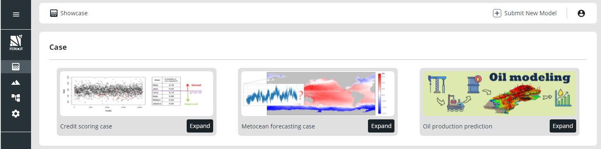
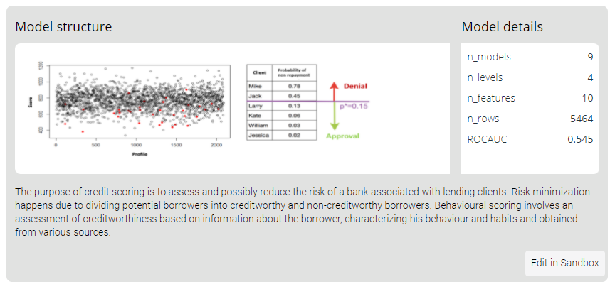
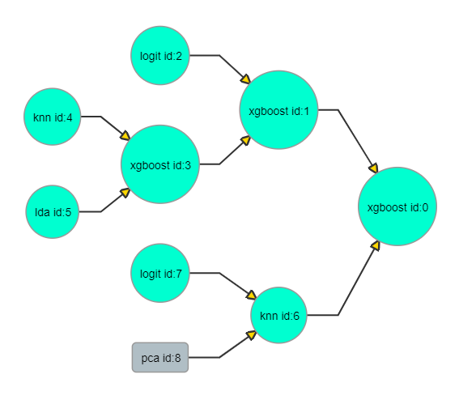
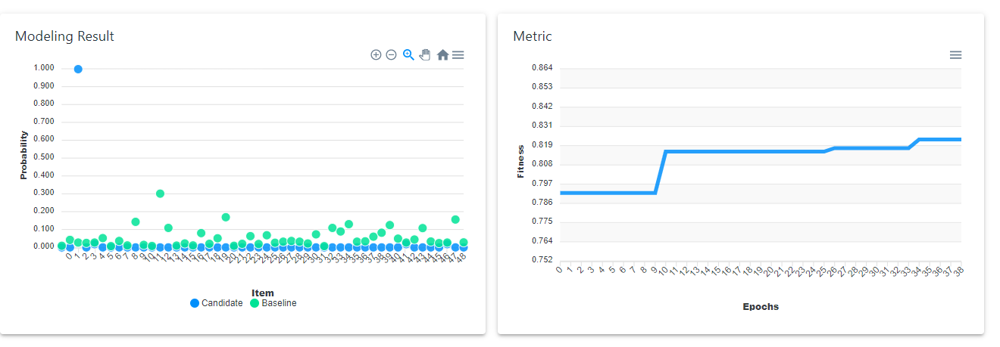
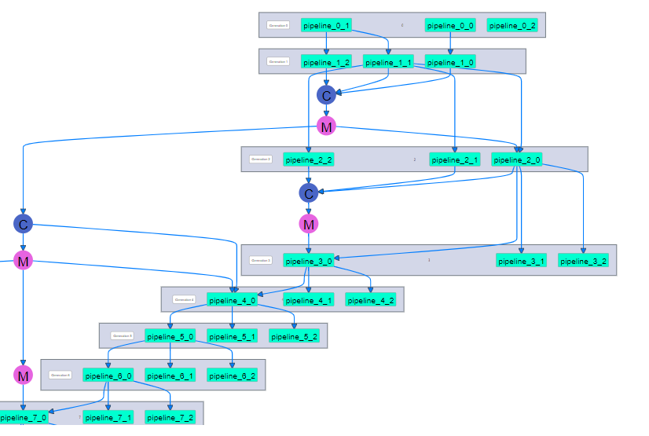

# FEDOT.Web

This repository contains the tool for interactive editing, evolution and visualization of the composite machine learning
models obtained with [FEDOT](https://github.com/nccr-itmo/FEDOT) AutoML Framework. The online version this tool is
available in https://fedot.onti.actcognitive.org/

## Demo

## Documentation

* [Tutorial](./docs/users_guide.pdf) for beginners
* [Tutorial](./docs/developer_manual.md) for advanced users (local run)

## Main pages

### Showcase of the models

Description of several domain-specific cases that can be sovled using composite pipelines

### Detailed model description

Detailed description of domain case, pipeline and its paramaters for specified case

### Composite model editor

Interactive editor of the pipeline structure. All nodes, edges, and hyperparameters can be changed.

### Analytics

Analytics for the current pipeline and its history of evolution.

### Evolution history

The visualisation of the evolution history.

## Algorithmic core

Open-source AutoML framework [FEDOT](https://github.com/nccr-itmo/FEDOT)

## Acknowledgments

We acknowledge the contributors for their important impact and the participants of the numerous scientific conferences
and workshops for their valuable advice and suggestions. The project is funded by ITMO University students R&D project
№620175.

## Contacts

[Telegram channel](https://t.me/FEDOT_helpdesk) for solving problems and answering questions on FEDOT and FEDOT.Web

[Natural System Simulation Team](https://itmo-nss-team.github.io/)

[Newsfeed](https://t.me/NSS_group)

[Youtube channel](https://www.youtube.com/channel/UC4K9QWaEUpT_p3R4FeDp5jA)

## Citation

@article{nikitin2021automated, title = {Automated evolutionary approach for the design of composite machine learning
pipelines}, author = {Nikolay O. Nikitin and Pavel Vychuzhanin and Mikhail Sarafanov and Iana S. Polonskaia and Ilia
Revin and Irina V. Barabanova and Gleb Maximov and Anna V. Kalyuzhnaya and Alexander Boukhanovsky}, journal = {Future
Generation Computer Systems}, year = {2021}, issn = {0167-739X}, doi = {https://doi.org/10.1016/j.future.2021.08.022}}