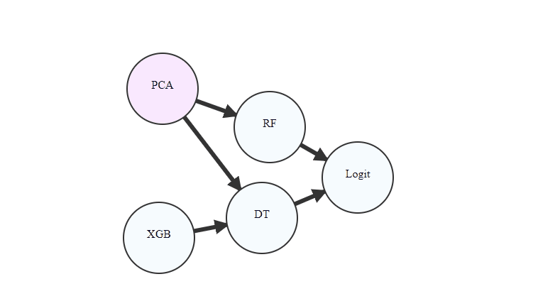

# FEDOT.Web

This repository contains prototype of tool for interactive editing and visualization of the composite models obtained with FEDOT Framework.

# Prototype of the composite model editor

## Expected design

## Algorithmic core

Open-source AutoML framework [FEDOT](https://github.com/nccr-itmo/FEDOT)

## Acknowledgments
We acknowledge the contributors for their important impact and the participants of the numerous scientific conferences and workshops for their valuable advice and suggestions.

## Contacts

[Telegram channel](https://t.me/FEDOT_helpdesk) for solving problems and answering questions on FEDOT and FEDOT.Web

[Natural System Simulation Team](https://itmo-nss-team.github.io/)

[Newsfeed](https://t.me/NSS_group)

[Youtube channel](https://www.youtube.com/channel/UC4K9QWaEUpT_p3R4FeDp5jA)

## Citation
@article{nikitin2020structural,
title={Structural Evolutionary Learning for Composite Classification Models}, author={Nikitin, Nikolay O and Polonskaia, Iana S and Vychuzhanin, Pavel and Barabanova, Irina V and Kalyuzhnaya, Anna V}, journal={Procedia Computer Science}, volume={178}, pages={414--423}, year={2020}, publisher={Elsevier}}

@inproceedings{kalyuzhnaya2020automatic,
title={Automatic evolutionary learning of composite models with knowledge enrichment}, author={Kalyuzhnaya, Anna V and Nikitin, Nikolay O and Vychuzhanin, Pavel and Hvatov, Alexander and Boukhanovsky, Alexander}, booktitle={Proceedings of the 2020 Genetic and Evolutionary Computation Conference Companion}, pages={43--44}, year={2020}}