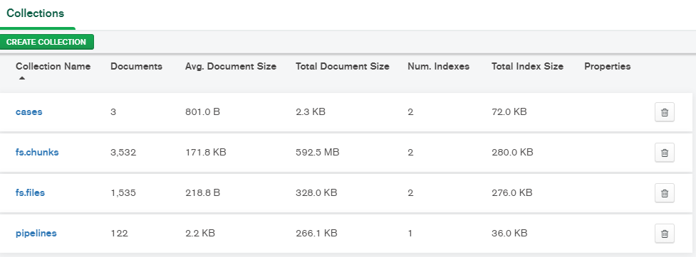
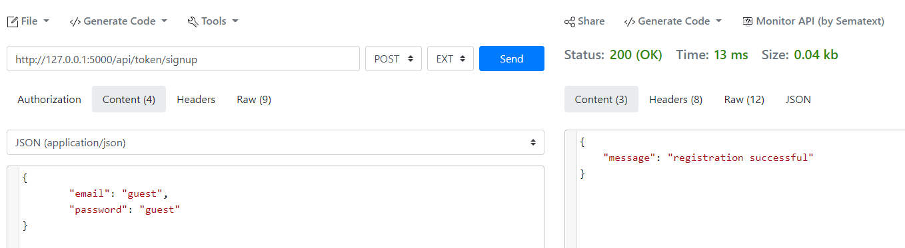

# Developer manual

This is an instruction for the advanced user of FEDOT.Web that wants to run it locally.

There are following steps should be conducted:

### Install all dependencies from requirements.txt.

The following command can be used: pip install -r requirements.txt The use of a separate environment is recommended.

### Setup database

Install local MongoDB (https://www.mongodb.com/try/download/community) or use the remote
one (https://www.mongodb.com/cloud).

#### Windows installation:

local user name and passwords are required during installation; to resolve possible errors,, additional command ‘net
localgroup "Performance Monitor Users" /add’ should be executed in Admin mode.

The database can be analyzed using MongoDB Compass. The expected state after initialization is:



### Add environment variables:

Path to server for frontend:
set REACT_APP_BASE_URL=http://127.0.0.1:5000

Connection string for the main database:

MONGO_CONN_STRING: mongodb://127.0.0.1:27017/test_db?compressors=zlib

## Build frontend

Move to “frontend” folder and run

a) npm install

b) yarn build

from console.

## Generate datasets

Run init_db.py to pre-initialise the database with default cases.

## Run MongoDB server

Run mongo command to start the database server.

## Run server

Run main.py script to start the server.

## Initialize users

Open http://localhost:5000/api in the browser.

Use https://reqbin.com/ to create the users with http://localhost:5000/api/token/signup

The example of request body is:

```json
{
"email": "guest",
"password": "guest"
}
```

Expected response:

