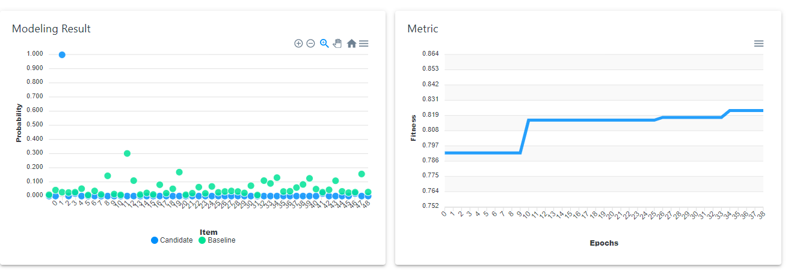

# User manual

How to use FEDOT.Web as a remote web service:

## First steps

Go to https://fedot.onti.actcognitive.org/
Press “Sign In as guest” or use your login/password (can be obtained from nnnikin@itmo.ru)

## Selection of the case

Choose the case of analysis.

## Primary analysis

Analyze the details of the models. Go to sandbox.

## Detailed analysis

Analyze convergence plots and modelling results.

## Analysis of the evolution history

Go to evolution history, select promising pipelines.

## Interactive modifications

Modify pipeline structure if necessary. Validate and evaluate the pipeline.
